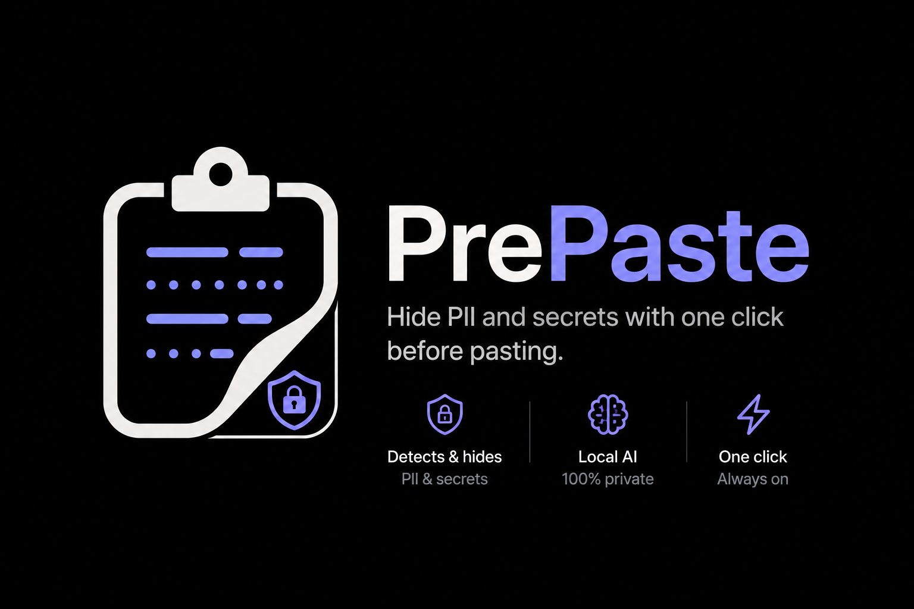
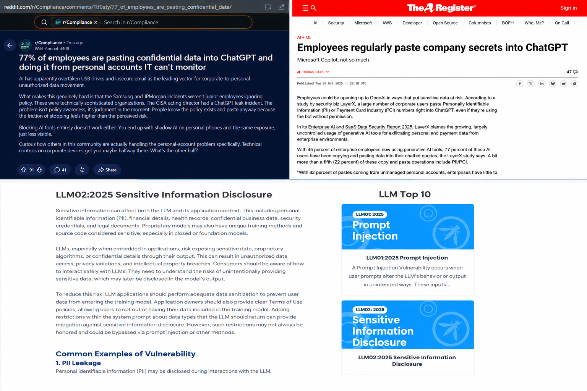

# PrePaste




> **The privacy layer between Ctrl+C and Ctrl+V.**

PrePaste is a local-first clipboard privacy assistant that helps prevent accidental data leaks before they happen.

As AI assistants become part of everyday workflows, developers and employees frequently copy code, documents, credentials, API keys, and personal information into Large Language Models (LLMs). Most leaks are not intentional; they happen because **copy and paste is muscle memory**.

PrePaste integrates seamlessly into that workflow. It monitors clipboard activity locally, detects sensitive information, and gives users the opportunity to review or redact it before it is shared.

Everything runs locally.

Nothing is uploaded.

Nothing leaves your computer.

---

# Why PrePaste?



The workflow usually looks like this:

```text
Copy something
        ↓
Open an AI assistant
        ↓
Paste
        ↓
Oops.
```

Whether it's:

* API keys
* Access tokens
* Customer information
* Internal documentation
* Email addresses
* Phone numbers
* Passwords
* Personally Identifiable Information (PII)

...once the content has been pasted, it may already be too late.

PrePaste adds a privacy layer between **Ctrl+C** and **Ctrl+V**, helping users detect and redact sensitive information before it reaches AI models, emails, chat applications, or any other destination.

---

# Features

## Local-first by Design

All processing happens entirely on the user's device.

* No cloud inference
* No external APIs
* No telemetry
* No internet connection required

Users remain in complete control of their clipboard and their data.

---

## Intelligent PII Detection

PrePaste uses **Microsoft Presidio** to identify common Personally Identifiable Information (PII), including:

* Person names
* Email addresses
* Phone numbers
* Credit card numbers
* IP addresses
* Organizations
* Locations
* National identifiers
* Additional supported Presidio entities

---

## Credential and Secret Detection

Beyond traditional PII, PrePaste includes custom recognizers capable of identifying credential-shaped values such as:

* API Keys
* GitHub Personal Access Tokens
* AWS Credentials
* JWT Tokens
* Bearer Tokens
* Database connection strings
* Private keys
* Generic secrets

Pattern matches are heuristic-based and indicate potential credentials rather than confirming validity.

---

## Clipboard Protection

PrePaste continuously monitors clipboard changes.

Whenever sensitive content is detected, users can be notified through either:

* Native Windows notifications
* A custom desktop overlay built with Flet

This allows users to review clipboard content before it is accidentally shared.

---

## One-click Redaction

Detected information can be automatically redacted with a single click.

Instead of manually searching through large documents or source code, users can safely sanitize clipboard content in seconds while preserving the surrounding context.

---

## Redaction Comparison

Every redaction can be reviewed before use.

The standalone comparison viewer displays:

* Original clipboard content
* Redacted output
* Highlighted modifications
* Exact affected line numbers

This provides complete transparency into every change made during the redaction process.

---

## Local History

PrePaste can optionally maintain a local history of previous redactions.

Each entry includes:

* Original clipboard text
* Redacted clipboard text
* Timestamp
* Line numbers
* Unique event identifier

History is stored locally and never synchronized externally.

---

## Configurable Detection

PrePaste is designed to adapt to different workflows.

Users can configure:

* PII detectors
* Credential detectors
* Detection confidence
* spaCy language model
* Clipboard behavior
* Notification preferences
* Local history retention

Every detector can be independently enabled or disabled.

---

# Architecture

```text
Clipboard
      │
      ▼
Clipboard Monitor
      │
      ▼
Detection Pipeline
      │
 ┌────┴─────────────┐
 ▼                  ▼
Microsoft      Custom Secret
Presidio       Recognizers
      │
      ▼
Detection Results
      │
      ▼
Notification Layer
      │
 ┌────┴─────┐
 │          │
Ignore   Redact
              │
              ▼
Local History
              │
              ▼
Comparison Viewer
```

---

# Settings Application

Launch the configuration interface:

```powershell
python settings.py
```

Settings are stored for the current Windows user in:

```text
%LOCALAPPDATA%\PrePaste\settings.json
```

Clipboard history is stored in:

```text
%LOCALAPPDATA%\PrePaste\history.json
```

The settings application allows users to configure detection categories, sensitivity, notification behavior, clipboard actions, history retention, and other runtime preferences.

---

# Standalone Redaction Viewer

Launch the comparison window:

```powershell
python redaction_viewer.py
```

The viewer reads history entries from `history.json` and opens the currently selected record using:

```text
%LOCALAPPDATA%\PrePaste\viewer_selection.json
```

Example:

```json
{
  "id": "61eb4ede-f8eb-458c-baeb-976b4cd02968"
}
```

If the selection file is missing, malformed, or references a deleted record, the viewer automatically falls back to the most recent valid redaction.

---

# Clipboard History

Each redaction event is stored locally using the following structure:

```json
{
  "id": "unique-event-id",
  "timestamp": "2026-07-20T12:34:56+00:00",
  "source": "Clipboard redaction",
  "kind": "redaction",
  "line_numbers": [2, 5],
  "original_text": "...",
  "redacted_text": "..."
}
```

---

# Installation

Clone the repository:

```bash
git clone https://github.com/TheAnshulPrakash/PrePaste.git

cd PrePaste
```

Install the required dependencies:

```powershell
python -m pip install -r requirements.txt
```

Download the required spaCy language model:

```powershell
python -m spacy download en_core_web_lg
```

---

# Quick Start

1. Clone the repository:

```bash
git clone https://github.com/TheAnshulPrakash/PrePaste.git
cd PrePaste
```

2. Install the required dependencies:

```powershell
python -m pip install -r requirements.txt
```

3. Download the required spaCy language model:

```powershell
python -m spacy download en_core_web_lg
```

4. Start PrePaste:

```powershell
flet run notif.py
```

The application will begin monitoring clipboard activity in the background. Whenever sensitive information is copied, PrePaste will analyze it locally and notify you if redaction is recommended.

---

# Running Individual Components

Launch the main application:

```powershell
flet run notif.py
```

Launch the settings application:

```powershell
python settings.py
```

Launch the redaction comparison viewer:

```powershell
python redaction_viewer.py
```

Run the standalone scanner:

```powershell
python presidio_redact.py "Contact Priya Shah at priya@example.com"
```

Or scan a text file:

```powershell
Get-Content message.txt -Raw | python presidio_redact.py
```

---

# Example Output

```text
Line 1 (EMAIL_ADDRESS, PERSON, PHONE_NUMBER):
Contact Priya Shah at priya@example.com or +1 555-123-4567.
```

Credential-shaped values are reported without exposing the detected secret.

```text
Line 2 (GitHub Personal Access Token):
token = ghp_...
```

---

# Privacy

Privacy is the foundation of PrePaste.

* Local processing only
* No cloud services
* No telemetry
* No external APIs
* User-controlled clipboard history
* Fully configurable detection pipeline

Your clipboard remains under your control at all times.

---

# Technology Stack

* Python
* Flet
* Microsoft Presidio
* spaCy
* OpenAI Codex (development assistance)

---

# Roadmap

Planned improvements include:

* Cross-platform support for macOS and Linux
* OCR support for copied images and screenshots
* Browser integration for AI platforms
* Organization-specific secret detection
* Plugin support for custom recognizers
* Faster scanning of large files
* Additional language support
* Community-contributed detection libraries

---

# Contributing

Contributions, bug reports, feature requests, and improvements are welcome.

Whether you would like to improve the detection engine, add support for new credential types, or enhance the user experience, contributions are appreciated.

---

# License

See the `LICENSE` file for licensing information.

---

---

# Acknowledgements

PrePaste was conceived, designed, and developed by **Anshul Prakash** during **OpenAI Build Week**.

Throughout development, **OpenAI Codex** served as an AI coding partner, assisting with implementation, debugging, refactoring, architectural discussions, and rapid iteration. It helped accelerate development while allowing me to focus on product design, user experience, and solving the underlying problem.

**GPT-5.6** was used extensively throughout the project for brainstorming ideas, refining the user experience, improving documentation, reviewing code, generating technical explanations, and polishing the overall product presentation.

While AI significantly accelerated development, all product decisions, architecture, implementation, and final design choices were made by me.

---

## Created by

**Anshul Prakash**

Built during **OpenAI Build Week** using **Python**, **Flet**, **Microsoft Presidio**, **spaCy**, **OpenAI Codex**, and **GPT-5.6**.

> *The future of AI isn't about replacing developers; it's about helping them build better software.*

